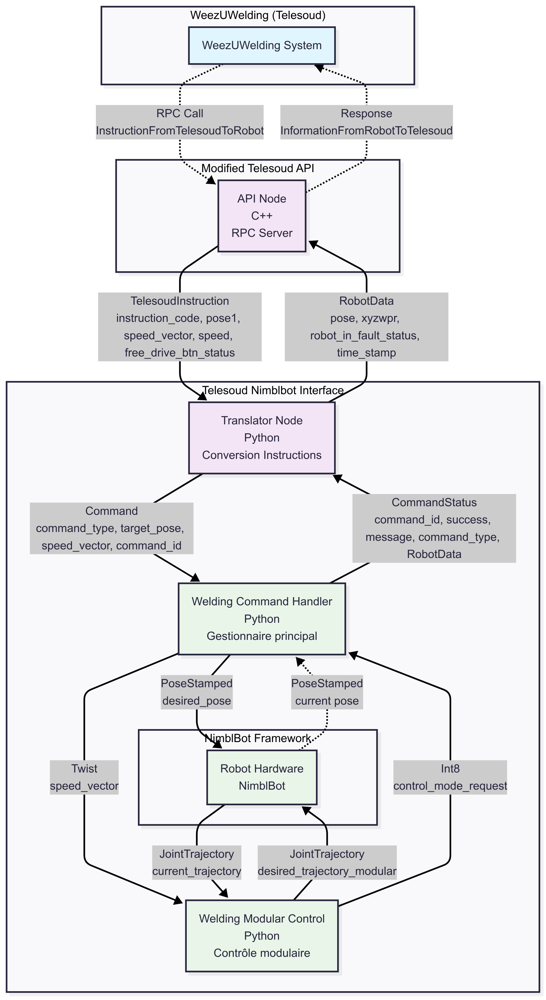

Telesoud NimblBot Interface Packages
====================================

The **telesoud_nimblbot_interface** package is the central component of the 
welding system, bridging Telesoud commands with NimblBot robot control through 
its three main modules: the Translator for protocol conversion, the Welding 
Command Handler for robot motion management and the Welding Modular Control : a re-implementation of the usual modular command for the WeezTouch controller. 

System Architecture
-------------------

   System architecture and data flow between Telesoud commands and NimblBot robot control

.. toctree::
   :maxdepth: 3
   :caption: Modules:
   
   translator
   welding_command_handler
   welding_modular_control
